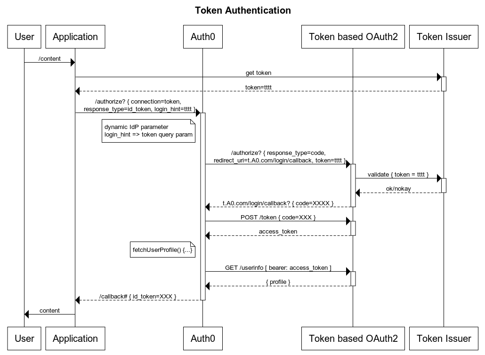
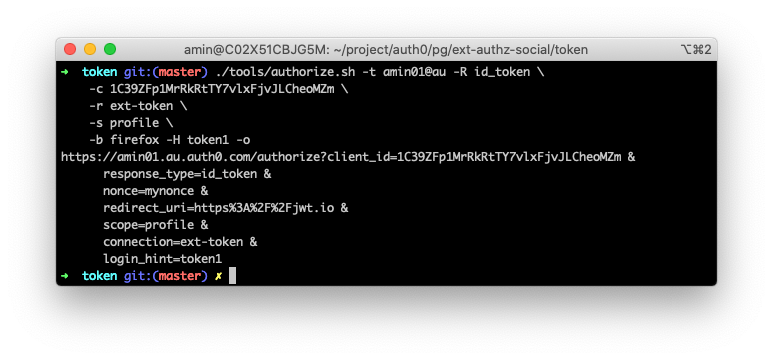
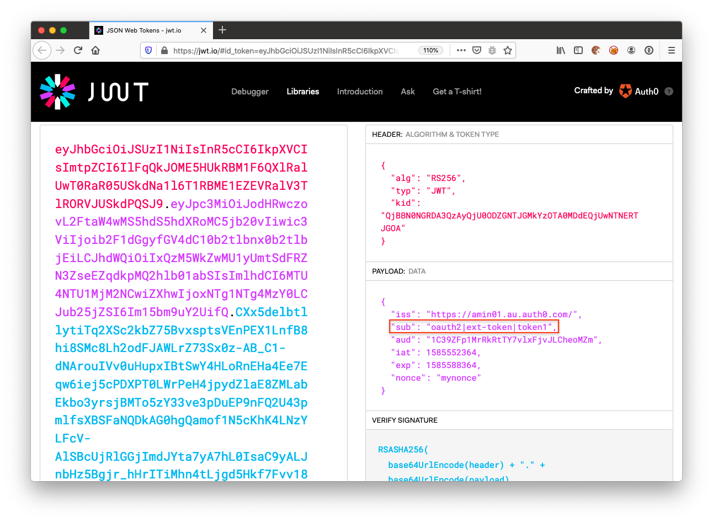

# Token Authentication in Auth0 using External Custom Social Connection
Setup explained in a [similar connection project for IP based authentication](https://github.com/abbaspour/auth0-ext-authz-ip).

## Use-cases
1. Time bound Pre-signed URLs 
2. Authenticated magic deep links
3. Legacy systems integration and SSO     

## Sequence

note: latest seq [here](https://www.websequencediagrams.com/files/render?link=D3705RSBF0BGz0Ab6czXz3k5bnSo9Q0bMBb6VnzJRq3aw3xOmCD6wfpUVQMZM3SK).

### Create Custom Social Connection

```bash
./tools/create-connection.sh -d https://ext-authz-token.herokuapp.com \
    -c ${client_id} \
    -x ${client_secret} \
    -e MY_AUTH0_CLIENT_ID
```

### Test Against Social Connection
#### Local
```bash
./tools/authorize.sh -d http://localhost:8081/auth/oauth \
    -H token1 \
    -c ${client_id} \
    -u ${redirectUris} \
    -s profile \
    -R code \
    -b firefox \
    -o
```

#### Auth0
```bash
./tools/authorize.sh -t amin01@au \
    -H token1 \
    -c MY_AUTH0_CLIENT_ID \
    -r ext-token \
    -s profile \
    -b firefox \
    -o
```

#### Request Id Token


#### Decode Payload


### Resources 
- [Pass Parameters to Identity Providers](https://auth0.com/docs/connections/pass-parameters-to-idps)
